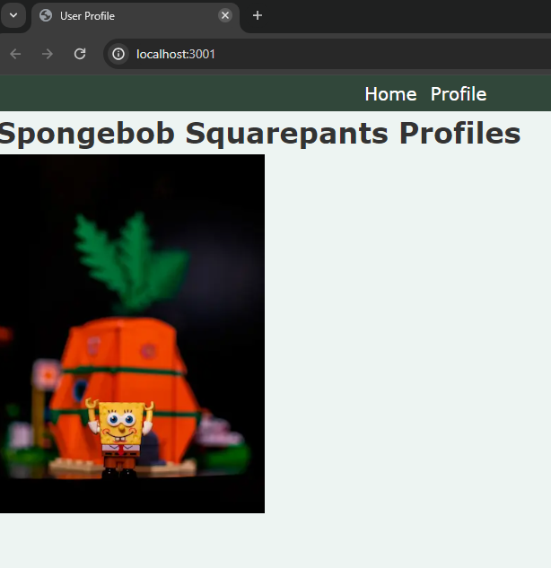
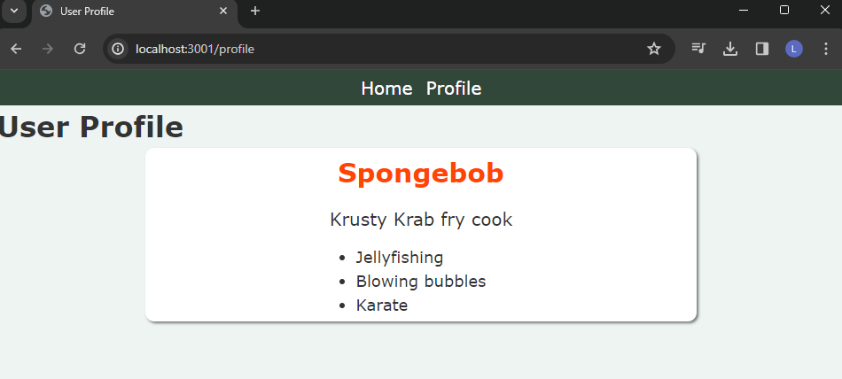

# Styles Assignment 1

## Objective

The goal of this assignment is to develop a Next.js application using advanced styling techniques, specifically Sass with the 7-1 architecture, SCSS Modules, and BEM methodology. You will create a user profile page that showcases dynamic styling and user interaction. Additionally, deploying your application to Netlify will be part of this assignment, enabling you to practice deploying Next.js applications.

## Spongebob User Profile

This project is a Next.js application showcasing Spongebob Squarepants profile. It utilizes Sass with the 7-1 architecture for styling, SCSS Modules, and BEM methodology. The objective of this project is to develop a user profile page that showcases dynamic styling and user interaction, along with deploying the application to Netlify.

## Setup and Styling

### Sass Architecture

The Sass files are organized using the 7-1 architecture pattern within the `styles/` directory.

### SCSS Modules and BEM Methodology

Each component has its SCSS module file following the BEM methodology for class naming.

## Home Page

The Home page renders a navbar, header, and Image.  


## Profile Page

The Profile page renders a navbar, header, and the UserProfile component that displays user information such as name, biography, and hobbies.  


This is a [Next.js](https://nextjs.org/) project bootstrapped with [`create-next-app`](https://github.com/vercel/next.js/tree/canary/packages/create-next-app).

## Getting Started

First, run the development server:

```bash
npm run dev
# or
yarn dev
# or
pnpm dev
# or
bun dev
```

Open [http://localhost:3000](http://localhost:3000) with your browser to see the result.

You can start editing the page by modifying `app/page.js`. The page auto-updates as you edit the file.
